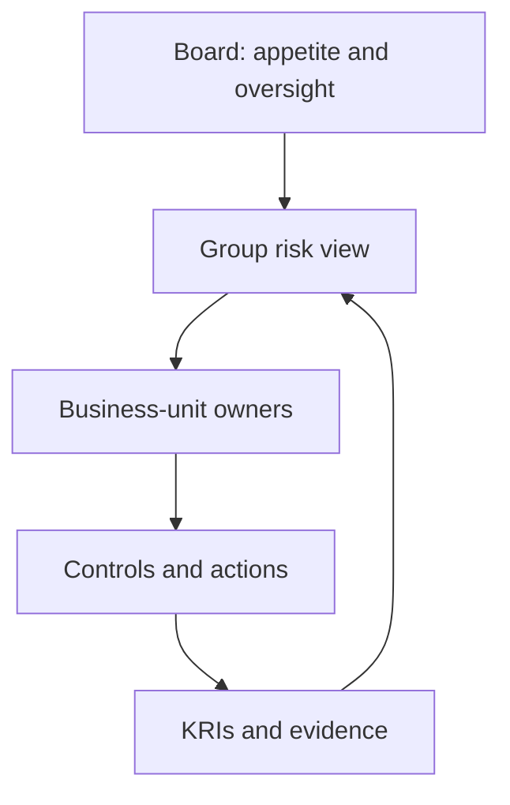
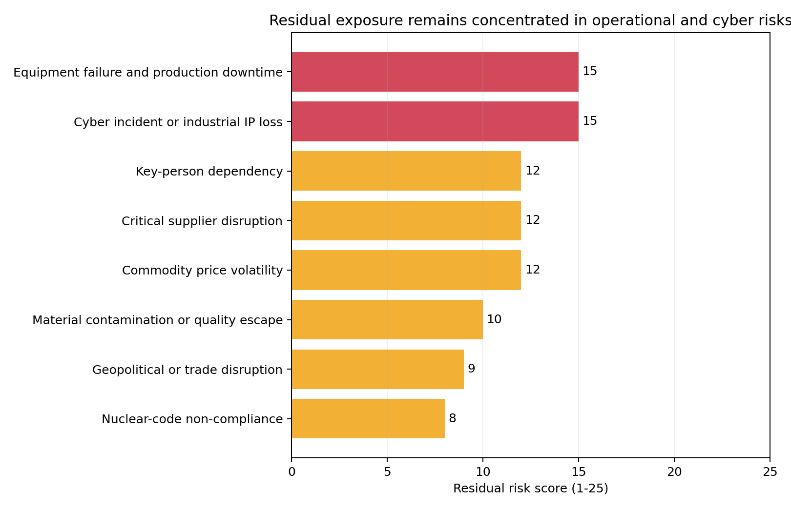
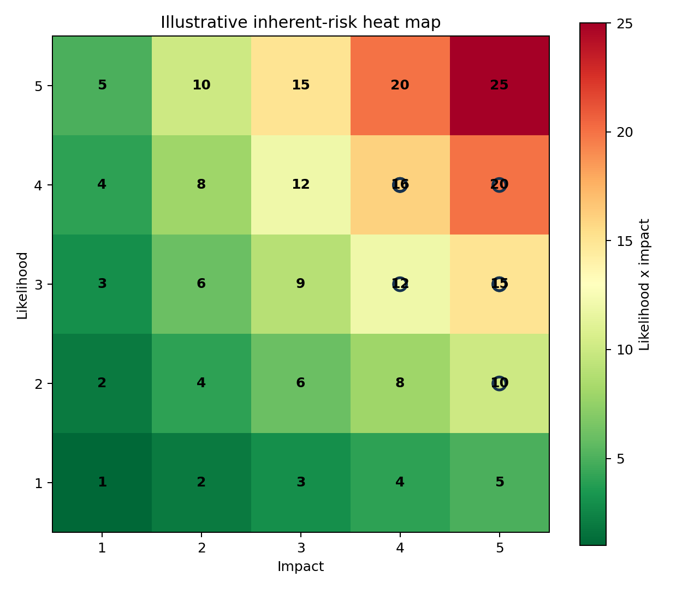

# Enterprise Risk, Made Operational

> A board-to-frontline control model for a £25M engineering group

[](https://github.com/Vedant-Au/enterprise-risk-management-framework/actions/workflows/quality.yml)

**Client context:** WB Alloys Group | **Engagement role:** Team Lead

The challenge was not producing a longer list of risks. It was creating a reporting rhythm that could work across business units and jurisdictions without importing enterprise-scale bureaucracy.

## The operating model



The recommended sequence is governance first, register second, monitoring third and advanced analytics last. Monte Carlo analysis is not maturity if ownership, taxonomy and KRI data are still inconsistent.

## What the board would see



The model brings commodity exposure, equipment downtime, supplier interruption, cyber risk and key-person dependency into one escalation view. It distinguishes:

- **inherent exposure** from **post-control residual risk**;
- a control description from evidence that the control works;
- board-level escalation from local action ownership; and
- strategic risks from process failures better assessed through FMEA.



## First 90 days

| Weeks | Management action | Proof of progress |
| --- | --- | --- |
| 1-3 | Approve appetite, taxonomy and reporting ownership | Named sponsor and accountable owners |
| 4-6 | Run facilitated scoring and control-evidence workshops | No red risk without an action and owner |
| 7-9 | Define KRIs and escalation thresholds | Monthly indicators for priority risks |
| 10-12 | Produce the first consolidated review | Decisions, overdue actions and exceptions recorded |

The longer maturity path is set out in the [adoption roadmap](docs/ADOPTION_ROADMAP.md).

## Control design, not decorative scoring

The repository implements a register, 5×5 inherent/residual scoring, RAG escalation, FMEA prioritisation and KRI fields. The design deliberately avoids calculating residual risk from a generic “control percentage”; effectiveness has to be evidenced and judged.

Read the [control model](docs/CONTROL_MODEL.md) for the scoring logic and the [assurance notes](docs/ASSURANCE_NOTES.md) before interpreting the example register.

## Run the model

```bash
pip install -r requirements.txt
python analysis.py
python -m unittest discover -s tests -v
```

[`analysis.py`](analysis.py) builds the decision tables and charts; [`tests/`](tests/) checks scoring, bounds and reconciliations.

> This is a sanitised implementation, not an official WB Alloys risk register. Organisation-specific appetite, owners, controls and scores require facilitated validation. See [ASSET_NOTICE.md](ASSET_NOTICE.md).
